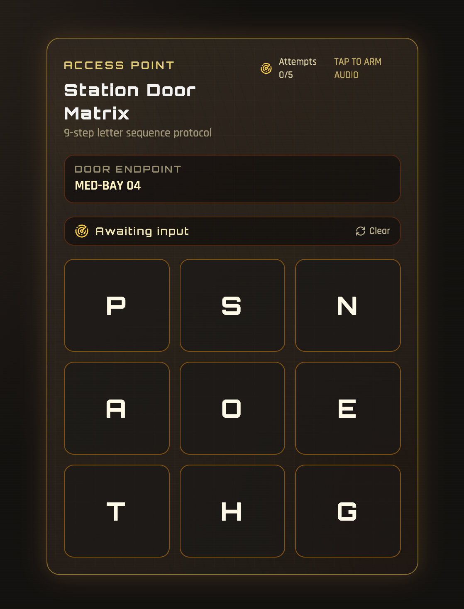

# Pinpad Doors Prop

A single-screen TTRPG digital prop that simulates a worn space-station access panel.

[MIT License](LICENSE) | [Contributing](CONTRIBUTING.md)

## Features

- 3x3 keypad with strict 9-letter ordered entry
- Door definitions loaded from `public/doors.yaml`
- Lockout after 5 failed attempts
- Inactivity reset after 30 seconds
- Admin reset via triple-tap on **Access Point**
- Door-specific URLs:
  - `/door/<slug>`
  - `/?door=<slug>`

## Project Structure

- `server.js`: built-in Node web server (no framework required)
- `public/index.html`: app UI + logic (React via CDN)
- `public/doors.yaml`: door data
- `docs/media`: optional screenshots and demo captures

## Screenshots / Demo



## Requirements

- Node.js 18+

## Install

```bash
npm install
```

## Quick Start

```bash
npm run doors
```

Then open `http://localhost:8000`.

For LAN devices, use your machine IP, for example `http://192.168.1.50:8000`.

## Scripts

- `npm run doors` - starts the built-in server on port 8000
- `npm run dev` - alias of `doors` for local development
- `npm start` - production-style start alias
- `npm run doors:links` - prints all door URLs from `public/doors.yaml`

## Runtime Configuration

Set host and port with environment variables:

```bash
HOST=0.0.0.0 PORT=8000 npm run doors
```

## Print Door Links

Generate all route links from your current `public/doors.yaml`:

```bash
npm run doors:links
```

Use a custom base URL (helpful before a game session):

```bash
BASE_URL=http://192.168.1.50:8000 npm run doors:links
```

## Door Routes

If a door name is `Engineering Bay`, the slug is `engineering-bay`.

Examples:

- `http://localhost:8000/door/engineering-bay`
- `http://localhost:8000/?door=engineering-bay`

## Edit Door Data

Update `public/doors.yaml`:

```yaml
doors:
  - name: Engineering Bay
    answer: ABYSSGATE
    grid: ["A", "B", "Y", "S", "G", "T", "E", "O", "R"]
  - name: Airlock 3
    answer: STARFIELD
    grid: ["S", "T", "A", "R", "F", "I", "E", "L", "D"]
```

Rules:

- `answer` must be exactly 9 letters
- `grid` must contain exactly 9 entries
- values are normalized to uppercase in app

## Tunable Gameplay Values

In `public/index.html`, adjust:

- `MAX_ATTEMPTS`
- `INACTIVITY_MS`
- `ERROR_RESET_MS`
- `ADMIN_TAP_WINDOW_MS`

## Notes

- Audio is generated with Web Audio API directly in each client browser.
- Admin reset remains available via a hidden control: triple-tap **Access Point** within `ADMIN_TAP_WINDOW_MS`.
- This project serves static files only; no backend persistence is used.

## Release Checklist

- [ ] Verify install and run (`npm install`, `npm run doors`)
- [ ] Validate door links (`npm run doors:links`)
- [ ] Test one success flow and one lockout flow
- [ ] Test at least one route via `/door/<slug>`
- [ ] Confirm docs match current scripts and behavior
- [ ] Add/update screenshots in `docs/media`

## Maintainer Workflow

- Pull requests use [.github/PULL_REQUEST_TEMPLATE.md](.github/PULL_REQUEST_TEMPLATE.md)
- Issues can be opened with:
  - [.github/ISSUE_TEMPLATE/bug_report.md](.github/ISSUE_TEMPLATE/bug_report.md)
  - [.github/ISSUE_TEMPLATE/feature_request.md](.github/ISSUE_TEMPLATE/feature_request.md)
 
## AI

- Inital chat with Gemini that provided the prompt to
- Co-Pilot which did most of the work
- Used [https://github.com/pbakaus/impeccable|impeccable] to polish and publish
